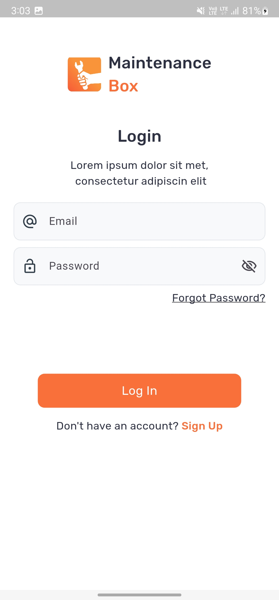
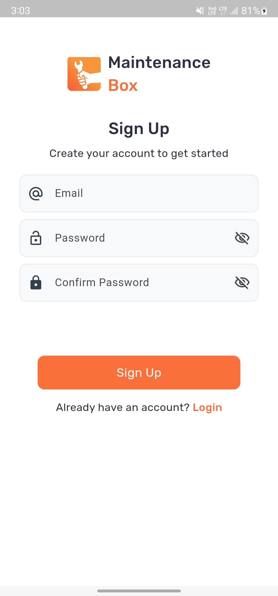

# 🎨 Flutter Basic UI Design

A beautiful and responsive Flutter app showcasing clean UI components and layout designs. This project is ideal for beginners and professionals looking to get inspired by structured, scalable, and reusable Flutter UI code.

## ✨ Features
- 🚀 Clean and elegant user interface
- 🧩 Reusable widget structure
- 📱 Responsive layout for all screen sizes
- 🌙 Light and simple color themes
- 💡 Ideal for learning UI/UX fundamentals in Flutter

## 📸 Screenshots

| Log In | SignUp |
|  |  

## 🛠️ Tech Stack
Flutter – Cross-platform UI toolkit
Dart – Fast, client-optimized language
Stateless & Stateful Widgets – For flexible UI building

## 📦 Dependencies
dependencies:
  flutter:
    sdk: flutter
  cupertino_icons: ^1.0.8

## 💡 Customization Tips
💻 Add more screens or components in the lib/screens/ folder
🎨 Modify theme styles in main.dart
🧱 Convert widgets into reusable components to make scalable designs

## 🙌 Acknowledgements
Flutter Team for excellent documentation and community support
Inspired by modern app design patterns and open-source templates

## 📄 License
This project is licensed under the MIT License.
See the LICENSE file for details.

## 👨‍💻 Created by Fasih Ullah
Feel free to ⭐ this repo and use it as inspiration in your own projects!
